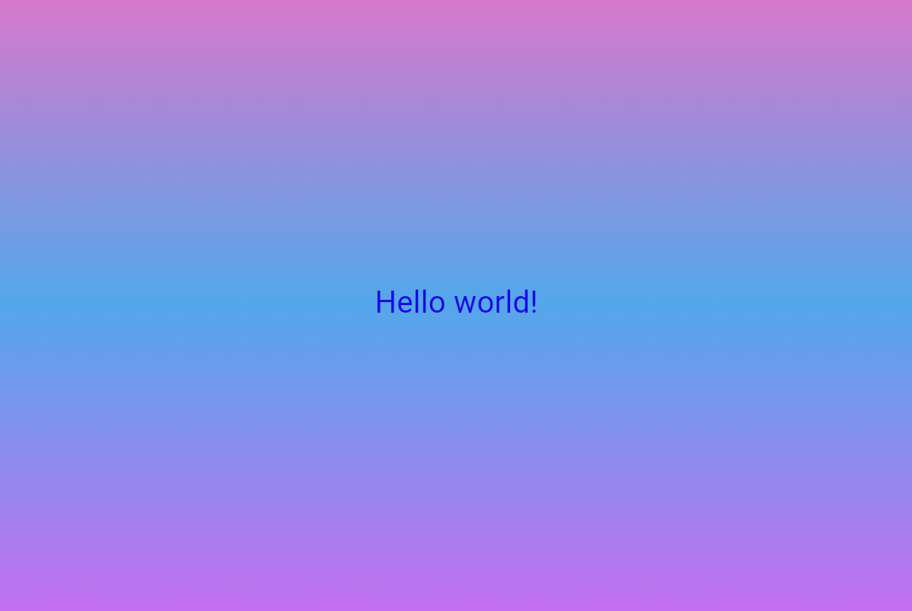

# Flutter Lab 3

Учебный проект по Flutter: приложение с градиентным фоном и стилизованным текстом.

## Автор
Хортюнова София Юрьевна ИСП-241

## Стек
- Flutter 3.41.8
- Dart 10.0.400
- Платформа: Web (Edge)
- IDE: VS Code

## Скриншот

## Запуск
1. Клонировать репозиторий
2. Перейти в папку проекта
3. Выполнить `flutter pub get`
4. Запустить `flutter run -d chrome`

## Что изучили
- Структуру Flutter-проекта
- Виджеты: MaterialApp, Scaffold, Container, Center, Text
- Hot Reload и Hot Restart
- Git и .gitignore
